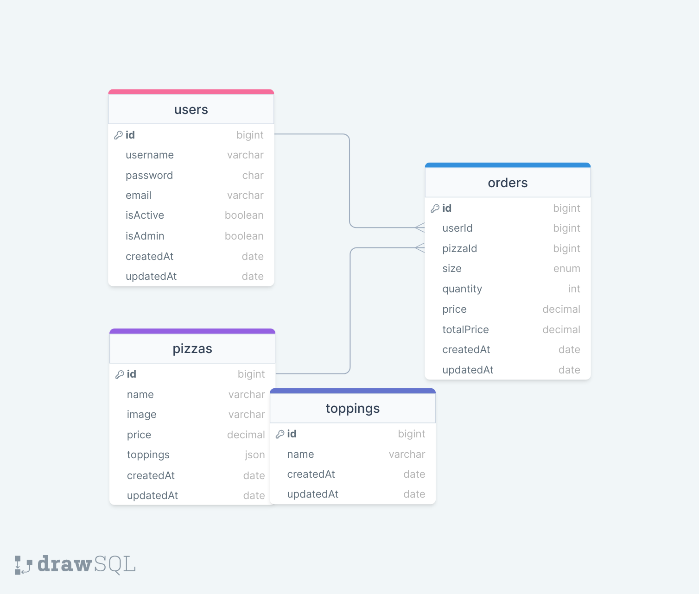

# Pizza Api Project

## Used technologies & Methods:
* Node.Js
* Express.Js
* Mongoose - MongoDB SQL
* Authorization And Permissions with JWT (Json Web Token)
* Password Crypto
* Documentation: Swagger / Redoc / Json
* Logging
-----

### ER (Entity Relationship Diagram) Diagram
</img> 

### Steps to be taken before running the project.

```
- The project is downloaded from the github repo.
- After the project is opened in VSCode, the following commands are run from the gitBash terminal.

$ npm init -y
$ npm i express dotenv express-async-errors
$ npm i mongoose
$ npm i morgan
$ npm i jsonwebtoken
$ npm i redoc-express swagger-autogen swagger-ui-express
$ echo PORT=8000 > .env
$ echo MONGODB=mongodb://127.0.0.1:27017/pizzaApi >> .env
$ cp ./env-sample ./.env
$ nodemon // * Running *

- The synchronization function in line 100 of the index.js file should be run once and disabled again.
- Testing is done with the following URL queries via Thunder Client or Postman or Browser. If changes are made to the Swagger file, the "$ node swagger.js" command should be used in the terminal.
```

### Folder/File Structure:

```
    src/
        config/
            dbConnection.js
        controllers/
            auth.js
            order.js
            pizza.js
            topping.js
            user.js
        helpers/
            passwordEncrypt.js
            setToken.js
            sync.js
        img/
            erdPizzaAPI.png
        middlewares/
            authentication.js
            errorHandler.js
            findSearchSortPage.js
            logger.js
            permissions.js
        models/
            order.js
            pizza.js
            topping.js
            user.js
        routes/
            auth.js
            order.js
            pizza.js
            topping.js
            user.js
    .env
    .gitignore
    config.env
    env-sample
    .env-sample
    index.js
    package-lock.json
    package.json    
    Readme.md
    swagger.js
    swagger.json
```
### Resources used
* https://mongoosejs.com/docs/queries.html
* http://expressjs.com/en/resources/middleware/cookie-session.html
* https://www.npmjs.com/package/cookie-session
* https://nodejs.org/api/crypto.html#cryptopbkdf2syncpassword-salt-iterations-keylen-digest
* https://www.mongodb.com/docs/manual/reference/operator/query/regex/
* https://jwt.io/
* https://expressjs.com/en/resources/middleware/morgan.html
* https://swagger-autogen.github.io/docs/
* https://expressjs.com/en/resources/middleware/morgan.html

> Designed By DOGUKAN © Nov 2023